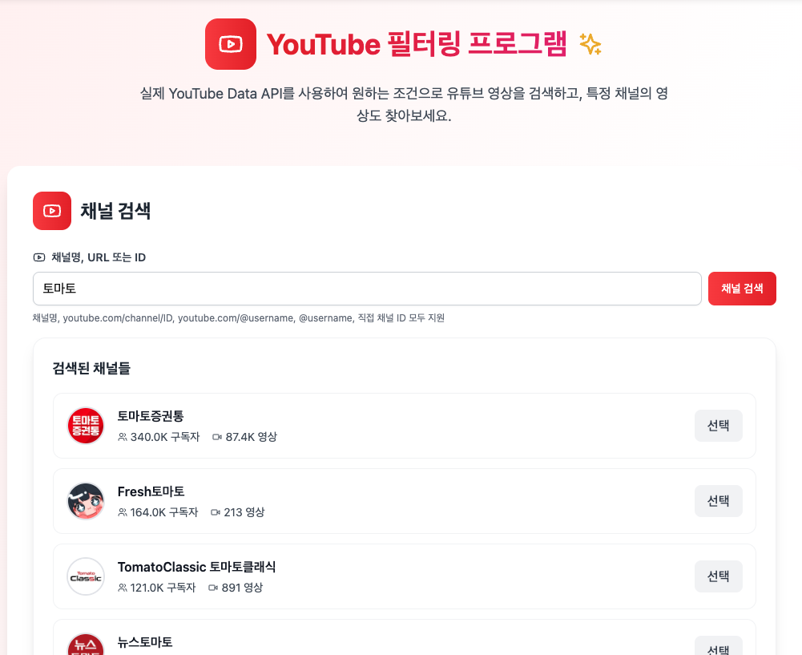
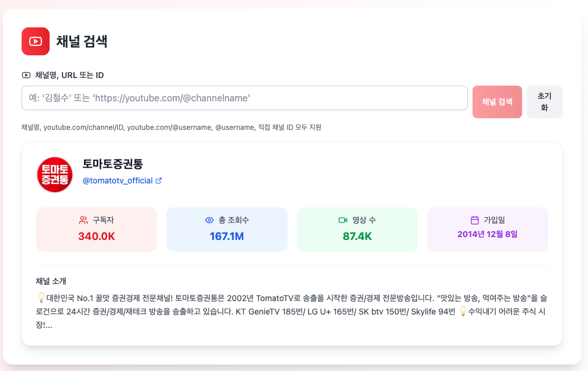
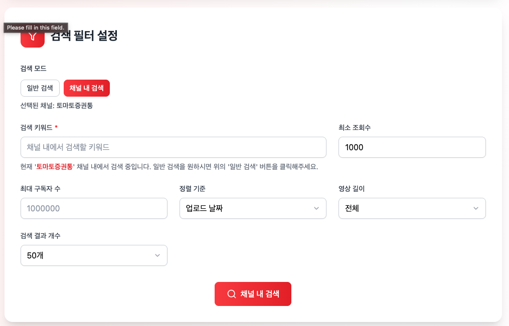

# YouTube Filtering Program

This is a React application that allows you to search for YouTube videos based on various criteria and find videos from specific channels, utilizing the real YouTube Data API. It was developed using <b>Bolt and Cursor</b>.






## 🚀 Key Features

- **Real-time YouTube Search**: Live video search via YouTube Data API v3
- **Advanced Filtering**: Supports various filters like view count, subscriber count, video length, and sort order
- **Channel Search**: Find channels by name, URL, or ID, and search for videos within those channels
- **Responsive Design**: Supports all devices from mobile to desktop
- **Accessibility**: Implemented with WCAG guidelines for improved accessibility

## 🛠 Tech Stack

- **Frontend**: React 18, TypeScript
- **Styling**: TailwindCSS
- **State Management**: Zustand
- **Data Fetching**: TanStack Query (React Query)
- **Testing**: Vitest, React Testing Library
- **Build Tool**: Vite
- **Icons**: Lucide React

## 📦 Installation & Usage

### 1. Install Dependencies

```bash
npm install
```

### 2. Configure Environment Variables

Create a `.env` file in the project root and set your YouTube API key:

```env
VITE_YOUTUBE_API_KEY=your_youtube_api_key_here
```

### 3. Run Development Server

```bash
npm run dev
```

### 4. Build for Production

```bash
npm run build
```

### 5. Run Tests

```bash
# Run all tests
npm test

# Run test UI
npm run test:ui

# Generate coverage report
npm run test:coverage
```

## 🏗 Project Structure

```
src/
├── components/          # React Components
│   ├── ui/             # Reusable UI Components
│   │   ├── Button.tsx
│   │   ├── Input.tsx
│   │   └── Select.tsx
│   ├── FilterForm.tsx  # Search Filter Form
│   ├── SearchResults.tsx # Display Search Results
│   ├── VideoCard.tsx   # Video Card Component
│   └── ChannelInfo.tsx # Channel Information Component
├── hooks/              # Custom Hooks
│   ├── useDebounce.ts
│   └── useLocalStorage.ts
├── stores/             # Zustand Store
│   └── youtubeStore.ts
├── services/           # API Services
│   └── youtubeApi.ts
├── types/              # TypeScript Type Definitions
│   └── index.ts
├── utils/              # Utility Functions
│   └── index.ts
└── test/               # Test Configuration
    └── setup.ts
```

## 🎯 Core Components

### FilterForm

- Keyword input for video search
- Advanced filter settings (view count, subscriber count, video length, etc.)
- Channel search and selection
- Displays real-time search results

### SearchResults

- Displays a list of search results
- Handles loading, error, and empty result states
- Responsive grid layout

### VideoCard

- Displays video information (title, channel, view count, upload date)
- Thumbnail download feature
- Link to YouTube video
- Accessibility support (keyboard navigation)

## 🔧 Development Guidelines

### Code Quality

- Strict TypeScript mode usage
- Adherence to ESLint rules
- Component-specific test writing
- Usage of accessibility attributes (aria-\*)

### State Management

- Client state: Zustand
- Server state: TanStack Query
- Clearly distinguishes states: `idle / loading / error / success`

### Styling

- Uses TailwindCSS
- Responsive design by default
- Consistent color and spacing system

### Testing

- Uses React Testing Library
- Writes user-centric tests
- Covers key features and edge cases

## 🧪 Testing

```bash
# Run unit tests
npm test

# Test specific file
npm test Button.test.tsx

# Coverage report
npm run test:coverage
```

## 📱 Responsive Design

- **Mobile**: Single column layout
- **Tablet**: Two-column layout
- **Desktop**: Three-column layout

## ♿ Accessibility

- Uses Semantic HTML
- Applies ARIA attributes
- Supports keyboard navigation
- Screen reader compatibility
- Adheres to color contrast guidelines

## 🔒 Security

- Manages API keys via environment variables
- Adheres to CORS policies
- Input validation and sanitization

## 📄 License

MIT License

## 🤝 Contributing

1.  Fork the Project
2.  Create your Feature Branch (\`git checkout -b feature/AmazingFeature\`)
3.  Commit your Changes (\`git commit -m \\\'Add some AmazingFeature\\\'\`)
4.  Push to the Branch (\`git push origin feature/AmazingFeature\`)
5.  Open a Pull Request

## 📞 Contact

If you have any questions about the project, please create an issue.
